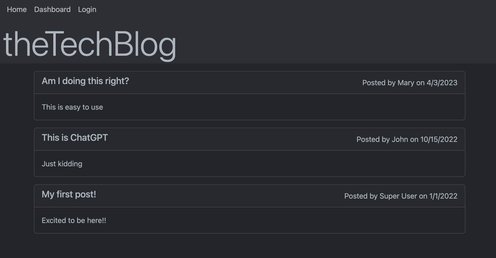
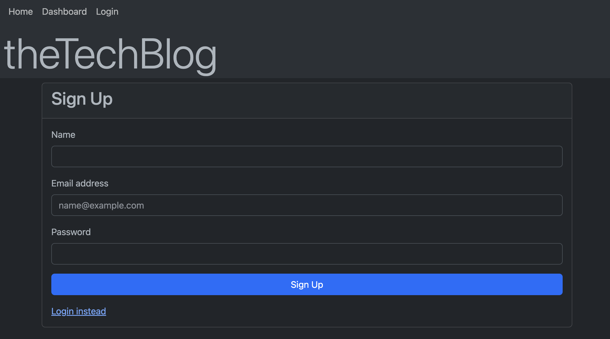
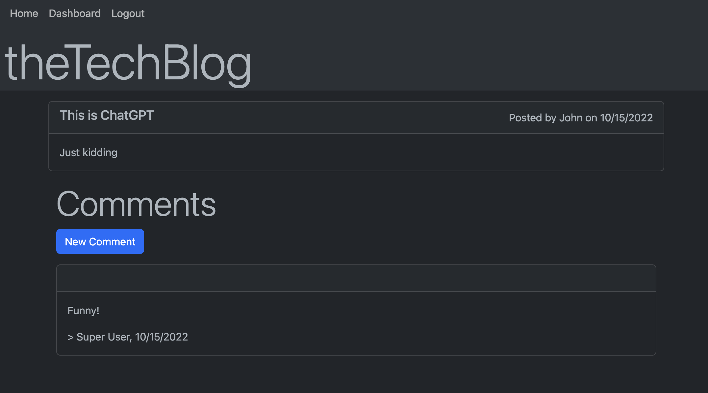

# Challenge 14 - Tech Blog

## Project Description

Collaborate with other developers by writing posts and sharing your thoughts and ideas with them. Invite other developers to sign up for an account and do the same. Let's continue to expand this great community!

This app was built using Express. The front end uses Handlebar templates, and the back end run on MySQL and Sequelize. User sessions are supported with the Express Session package.

Building this app from scratch was definitely challenging but I have learned a lot about other front end technologies such as Handlebars. It also helped me expand my back end knowledge using an ORM such as Sequelize.

## Table of Contents
- [User Story](#user-story)
- [Acceptance Criteria](#acceptance-criteria)
- [Links](#links)
- [Dependencies](#dependencies)
- [Usage](#usage)
- [Screenshots](#screenshots)

## User Story

```md
AS A developer who writes about tech
I WANT a CMS-style blog site
SO THAT I can publish articles, blog posts, and my thoughts and opinions
```

## Acceptance Criteria

```md
GIVEN a CMS-style blog site
WHEN I visit the site for the first time
THEN I am presented with the homepage, which includes existing blog posts if any have been posted; navigation links for the homepage and the dashboard; and the option to log in
WHEN I click on the homepage option
THEN I am taken to the homepage
WHEN I click on any other links in the navigation
THEN I am prompted to either sign up or sign in
WHEN I choose to sign up
THEN I am prompted to create a username and password
WHEN I click on the sign-up button
THEN my user credentials are saved and I am logged into the site
WHEN I revisit the site at a later time and choose to sign in
THEN I am prompted to enter my username and password
WHEN I am signed in to the site
THEN I see navigation links for the homepage, the dashboard, and the option to log out
WHEN I click on the homepage option in the navigation
THEN I am taken to the homepage and presented with existing blog posts that include the post title and the date created
WHEN I click on an existing blog post
THEN I am presented with the post title, contents, post creator’s username, and date created for that post and have the option to leave a comment
WHEN I enter a comment and click on the submit button while signed in
THEN the comment is saved and the post is updated to display the comment, the comment creator’s username, and the date created
WHEN I click on the dashboard option in the navigation
THEN I am taken to the dashboard and presented with any blog posts I have already created and the option to add a new blog post
WHEN I click on the button to add a new blog post
THEN I am prompted to enter both a title and contents for my blog post
WHEN I click on the button to create a new blog post
THEN the title and contents of my post are saved and I am taken back to an updated dashboard with my new blog post
WHEN I click on one of my existing posts in the dashboard
THEN I am able to delete or update my post and taken back to an updated dashboard
WHEN I click on the logout option in the navigation
THEN I am signed out of the site
WHEN I am idle on the site for more than a set time
THEN I am able to view comments but I am prompted to log in again before I can add, update, or delete comments
```
 
## Links

To access the code repository and live website, use the links below:

- ### GitHub Repository URL
    https://github.com/sergiorodriguezdev/chl-14-tech-blog 
- ### Heroku App URL
    https://chl-14-tech-blog.herokuapp.com/

## Dependencies

To install the appropriate dependencies, execute the following command from the repo folder:

```
npm install
```

## Usage

Clone or download the repo folder to your local machine and install the dependencies as specified in the [Dependencies](#dependencies) section. Then, launch the app using the following command:

```
npm start
```

To access the app, open a web browser and go to the URL specified in the terminal window - the default will likely be `http://localhost:3001`.

You can also deploy the app to your Cloud provider of choice following their documentation.

Features include:
- Sign up for an account using the Login option and then click the Sign Up link.
- View all posts from the Home page. Click on a post to view comments. Users who are logged in may leave a comment.
- Create posts from your dashboard.
- Edit or delete posts by clicking the individual posts from your dashboard.

## Screenshots








